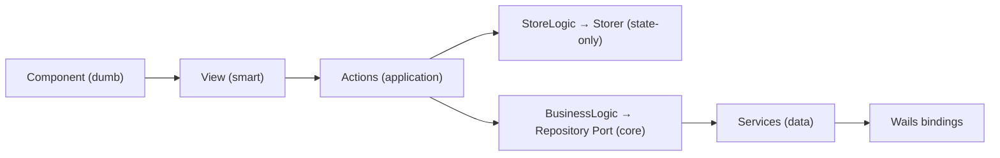

# Contributing to Codryn Desktop

Thanks for stopping by. Codryn is in beta, so every report and fix counts.

### You do not need to write code

Contributing is not only about pull requests. Opening an issue, reporting a bug you hit, sharing clear repro steps, improving docs, or suggesting an idea are all real contributions and very welcome.

## House rules

These apply to every contribution, code or not:

- Always use English, in code, comments, issues, and pull requests.
- In code comments, stick to standard keyboard characters. No em dashes, arrows, or other special symbols.
- Text the end user can see (buttons, labels, dialogs, error messages) must be written for end users, not developers.
- If a piece of logic depends on a backend response, always wait for that response first, then update the UI.

## Frontend architecture: keep the layers dumb and smart in the right places

`frontend/src/` follows clean architecture. The dependency direction is one-way: outer layers may depend on inner layers, never the reverse.



- **Components are dumb.** They render data and emit events. No API calls, no action calls, no state mutation. A component only talks to its parent via `emit()`.
- **Views are smart.** They compose components, call actions, and pass data down as props. Views handle layout; visual design belongs to components.
- **Writes go through actions.** Nothing in `presentation/` writes to stores or state directly, except a component-local `store/` inside its own folder for ephemeral UI state (open, hover, filter). That store is private: never exported, never imported from outside the component.
- **Styling split.** Views use Tailwind CSS. Components use pure scoped CSS, no Tailwind.

## Go side

The Go code (`app.go`, `internal/`) bridges Wails and the backend process. Keep it formatted and vetted:

```sh
gofmt -l .
go vet ./...
go test ./...
```

## Running it locally

```sh
# Frontend-only dev, mock API, no backend process
USE_MOCK=true

# Manual dev against an already running backend (no spawn)
BACKEND_URL=http://127.0.0.1:3000

# Default: spawn the backend CLI over STDIO
```

See `.env.example`. Values exported in your shell take precedence over the file.

## Opening an issue

For bugs, include the Codryn Desktop version, your OS, how the backend was connected (spawned, `BACKEND_URL`, or mock), steps to reproduce, what you expected versus what happened, and the relevant logs (never paste secrets or tokens). For ideas, describe the problem first, then the proposed change, which area it touches, and alternatives you considered.

## Pull requests

Open a pull request and fill in the template that GitHub loads automatically (`.github/PULL_REQUEST_TEMPLATE.md`). Keep one topic per pull request, describe how you verified it, and make sure these pass:

```sh
# Frontend (run inside frontend/)
npm run lint:check:oxlint
npm run lint:check:eslint
npm run format:check
npm run type-check
npm run build-only

# Go (run at repo root)
go vet ./...
test -z "$(gofmt -l .)"
go test ./...
```
